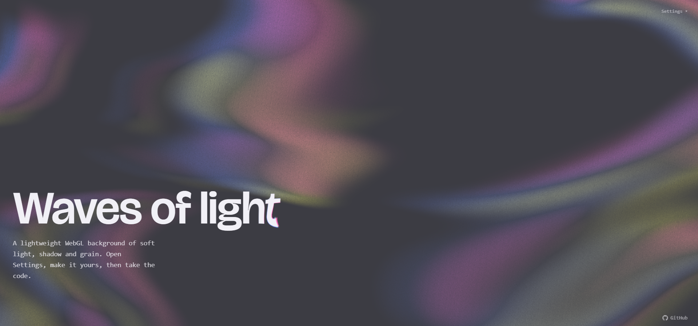

# wave-background



An animated background of soft light and shadow waves with grain, drawn over a solid color. It looks like sunlight moving on the sea floor.

- Plain WebGL in a single fragment shader. No dependencies besides React.
- Light and dark presets, with every color and value adjustable.
- Pauses while the tab is hidden, caps the pixel ratio and respects the "reduce motion" system setting.

## Files

| File | What it is |
| --- | --- |
| `CausticsBackground.jsx` | The background component. This is the only file you need. |
| `CausticsControls.jsx` | Optional settings panel with sliders and color pickers. |
| `src/main.jsx` | Demo page using both. |

## Demo

```bash
npm install
npm run dev
```

## Usage

Copy `CausticsBackground.jsx` into your project.

```jsx
import CausticsBackground from './CausticsBackground.jsx';

export default function App() {
  return (
    <>
      <CausticsBackground theme="light" />
      <main>Your content</main>
    </>
  );
}
```

The canvas is fixed behind the page (`z-index: -1`). Keep `<body>` without an opaque background, or pass `style={{ zIndex: 0 }}` and place your content above it.

### Props

Colors must be hex (`#rgb` or `#rrggbb`).

| Prop | Default | Description |
| --- | --- | --- |
| `theme` | `'light'` | Color preset: `'light'` or `'dark'`. |
| `background` | from theme | Solid background color. |
| `light` | from theme | Light color. |
| `colors` | `['#6987f4', '#ede96e', '#ff70c0']` | The three fringe colors. |
| `speed` | `0.1` | Motion speed. `1` = one cycle every 6 s, `0` = still. |
| `scale` | `0.5` | Higher = smaller shapes. |
| `warp` | `0.7` | Sway amplitude. |
| `shape` | `0.1` | `0` = soft blobs, `1` = thin lines. |
| `intensity` | `0.2` | Light strength. |
| `fringe` | `0.45` | Fringe color strength. |
| `dispersion` | `0.02` | Fringe width. |
| `grain` | `0.6` | Grain amount. |
| `grainSize` | `1.5` | Grain size in px. |
| `grainAnimated` | `false` | `true` = flickering grain. |
| `maxDpr` | `1.5` | Pixel ratio cap. Lower is faster. |
| `fps` | `60` | Frame rate cap. |
| `reducedMotion` | `'slow'` | When the system asks for reduced motion: `'slow'` (30% speed), `'pause'` or `'full'` (ignore). |
| `className`, `style` | | Passed to the `<canvas>`. |

Theme presets:

| Theme | `background` | `light` |
| --- | --- | --- |
| `light` | `#eae9f0` | `#ffffff` |
| `dark` | `#3c3c43` | `#dedcf2` |

### Settings panel

`CausticsControls.jsx` adds a small "Settings" button in the top right corner that opens a panel to change every option live.

```jsx
import { useState } from 'react';
import CausticsBackground, { DEFAULTS, THEMES } from './CausticsBackground.jsx';
import CausticsControls from './CausticsControls.jsx';

export default function App() {
  const [options, setOptions] = useState({ ...DEFAULTS, ...THEMES.light });

  return (
    <>
      <CausticsBackground {...options} />
      <CausticsControls value={options} onChange={setOptions} defaults={DEFAULTS} />
    </>
  );
}
```

See `src/main.jsx` for a version with a light/dark switch.

### Using the engine directly

The same file exports `createCaustics`, the plain JavaScript function behind the component. Use it to drive any `<canvas>` yourself. The file still imports React for the component, so for a project without React, copy everything above the `THEMES` export into its own `.js` file.

```js
import { createCaustics } from './CausticsBackground.jsx';

const effect = createCaustics(document.querySelector('canvas'), { speed: 0.2 });
effect.set({ grain: 0.4 }); // change options later
effect.destroy();           // stop and clean up
```

`createCaustics` returns `null` if WebGL is not available.

## Credits

- 2D simplex noise by Ian McEwan / Ashima Arts (MIT license).
- Motion inspired by the [Ethereal Shadow](https://21st.dev/@jatin-yadav05/components/etheral-shadow) component by Jatin Yadav.
